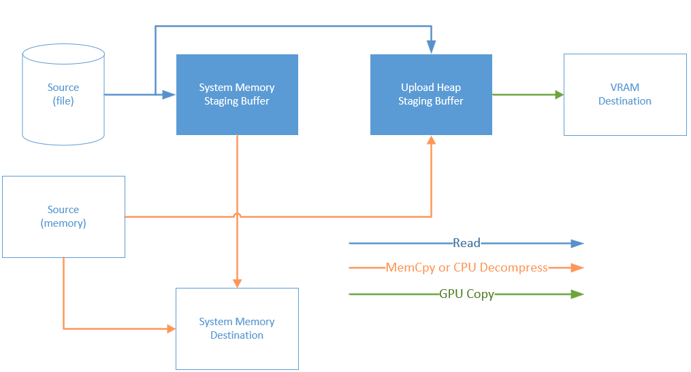

# Using DirectStorage
The dstorage.h header file contains inline comments that describe some more detail of methods and parameters.  While more extensive documentation will become available over time, a quick introduction follows:

## Basic Concepts
As with D3D12, the DirectStorage API is a "nano-COM" API.  The following interfaces are provided:
* IDStorageFactory - this can be used to obtain all other DirectStorage objects
* IDStorageFile - a file that is opened, ready to be used with DirectStorage
* IDStorageQueue - all operations are enqueued on a queue
* IDStorageStatusArray - an object that can store results of operations
* IDStorageCustomDecompressionQueue - if the game uses custom CPU decompression, then this is how DirectStorage communicates with the game.

A IDStorageFactory instance can be retrieved using the DStorageGetFactory() function.

## Queues and Operations
An application enqueues operations onto an IDStorageQueue.  There are three types of operations:
* "Request" - load some data from a file
* "Signal" - signal an ID3D12Fence
* "Status" - record the status of the last batch

Each enqueued operation takes up on slot in the queue, with the number of slots being specified at creation time.  This slot remains in use until the operation has completed. If Enqueue is called when there are no free slots then it will block until a slot becomes available.

Requests do not start processing until they are submitted.  The queue's Submit() function can be used to explicitly submit work.  Requests are also automatically submitted when the queue is half full.  Submitting will wake up the worker thread, so care should be taken to avoid calling it more than necessary.

Requests may complete in any order - so games must be careful to avoid making any assumptions about the order in which they complete.  The signal and status operations execute when all operations before them have completed, but otherwise have no impact on when requests may start executing.

Requests can read from memory or files.  Each individual queue can only service requests of on source type - so if a memory request is enqueued to a file queue then it will fail.  Memory sources allow DirectStorage's decompression functionality to be used with the data that is already present in memory.

Each individual queue is also bound to its source type and destination device.  The source type can be file or memory.  The destination device specifies whether requests on this queue go to system memory or GPU memory.

## Request Destinations
Each request must specify its request destination type.  For some destination types, DirectStorage has expectations of the layout of the data. For developers who are used to the Xbox DirectStorage, this is one of the large differences between the two APIs.  This is necessary because the graphics driver is responsible for determining the actual layout of the resources in memory, and so the assets must be stored on disk in an unswizzled format.

### DSTORAGE_REQUEST_DESTINATION_MEMORY
This destination type is for requests that target system memory. DirectStorage treats this as a simple array of bytes that are written to a pointer/size.

### DSTORAGE_REQUEST_DESTINATION_BUFFER
This destination type is for populating a portion of a buffer ID3D12Resource.  This takes a resource, offset and size for the destination.  Internally, DirectStorage uses CopyBufferRegion to put this in the correct final location.

### DSTORAGE_REQUEST_DESTINATION_TEXTURE_REGION
This destination type is for populating a region of a single subresource of a texture - the region could also be the entire subresource if desired. The source data is expected to be laid out in a format suitable for CopyTextureRegion. ID3D12Device::GetCopyableFootprints() can be used to retrieve the layout information. The request requires the resource, subresource index and destination region.

### DSTORAGE_REQUEST_DESTINATION_MULTIPLE_SUBRESOURCES
This destination is intended for populating mip tails - or entire textures - in a single request. This request takes a resource and the first subresource to populate. This subresource, and all remaining ones, are populated - so to populate an entire texture resource, set this value to 0.

As for texture regions, the data is expected to be laid out as described by GetCopyableFootprints(). DirectStorage will call CopyTextureRegion() for each subresource.

### DSTORAGE_REQUEST_DESTINATION_TILES
This destination type is for populating a region of tiles in a tiled resource.  This takes a resource and a region (in the form of a start coordinate and size). The data is expected to be arranged as suitable for passing to CopyTiles().

## Compressed Assets
The data that is read for each request myst be possible to decompress in its entirety. This means that it is not, in general, possible to apply a compression algorithm over a complete file, but instead each section of the file must be compressed in isolation. See the [MiniEngine (with DirectStorage support)](../Samples/MiniEngine/DirectStorage/README.md) sample for details of how a file containing data to be read by multiple requests might be arranged.

## Staging Buffers and Copying

DirectStorage maintains two staging buffers - one system memory buffer, and another in an upload heap. The above diagram shows the possible ways the data for a request can flow between staging buffers.

DirectStorage requires that the uncompressed data for a request can fit into a staging buffer. Requests that need to go through a staging buffer with an uncompressed size that is larger than the staging buffer size will fail. The staging buffer can be resized with the SetStagingBufferSize() method on the factory.

## Runtime Configuration
The default behavior of DirectStorage aims to provide the best performance on the system it is running on.  However, there are cases where games may want to change this behavior.

The DStorageSetConfiguration function allows games to control aspects of DirectStorage's runtime configuration. This function must be called before the IDStorageFactory is created (eg before the first call to DStorageGetFactory()).

### DSTORAGE_CONFIGURATION
A DSTORAGE_CONFIGURATION structure is passed to DStorageSetConfiguration(). The structure is designed such that zero-initializing the structure produces default behavior.

### NumSubmitThreads
Submitting IO requests can sometimes take a long time. To enable the DirectStorage worker thread to do other work during this time, DirectStorage uses a separate submission thread. By default DirectStorage uses 1 submission thread.  When running on Windows 10 it may be desirable to allow DirectStorage to use more submission threads to achieve a higher bandwidth/request count(by using additional CPU time).

### ForceMappingLayer and DisableBypassIO
During development it may be useful to force DirectStorage to only make use of the Windows 10 I/O stack.  Forcing the mapping layer to be used and toggling off BypassIO can be done to achieve this.

# Best Practices
The recommendations and best practices can be grouped into the following list of Do's and Don'ts when using DirectStorage.

## Do's
The pipeline model along with the use of notifications leads to several Do's for how to use DirectStorage.
* Submit as many requests at a time as you can to DirectStorage
  * The only limit on the number of requests in flight is the size of the queues the title creates.
* Submit requests in batches
  * Assets tend to be multiple blocks of data within the title package and notifications happens in FIFO order. This leads to submit requests in batches.
  * Enqueue read requests for all the data needed to create the in-game asset, then enqueue one IDStorageStatusArray entry or ID3D12Fence at the end. When the IDStorageStatusArray entry or ID3D12Fence is signaled all the data needed for the asset is guaranteed to be available.
* Read in 32-KiB or larger block sizes
  * The recommendation is to read at least 32-KiB with each read request. Smaller reads will negatively impact overall bandwidth.
* Size your queues correctly
  * There is a significant penalty when a read is enqueued and the queue is full. The Enqueue(Request/Status/Signal) functions suspend the thread until a slot becomes available. The suspension could easily be several milliseconds.
  * The recommendation is ~2x your expected maximum number of elements in the queue at a single point in time. This allows enough buffer space to handle possible variations in timing.
  * Remember as soon as a read is completed its slot is available for a new request.

## Dont's
Win32 and DirectStorage have slightly different usage cases. Some patterns that were common in Win32 will negatively impact performance in DirectStorage.
* Don't use DirectStorage with dependency change assets
  * A dependency chain is where you must load asset A before you know the next asset to load.
  * Because of the inherent latency in a single DirectStorage read you have a significant impact on performance using this pattern.
  * Consider the case when waiting 8ms for a single 512-KiB read. This comes out to a bandwidth of 64MB/s, the same speed as the rotational drive in an Xbox One X.
* Don't fear the auto submit
  * Auto submit happens when the number of unsubmitted requests is greater or equal to half the size of the queue.
  * The reason for auto-submit is to help avoid bubbles in the pipeline. There are a significant number of ready requests based on the title's chosen size of the queue so the drive should be notified to start processing.
  * The cost for an auto-submit is the same as a single call to Submit().
  * There is no effect on notification of completed reads. Notification is entirely based on the IDStorageStatusArray entry or the ID3D12Fence markers.
* Don't constantly create IDStorageQueue objects for each batch of assets.
  * Creation of a new IDStorageQueue requires at least some form of memory allocation. Just the overhead of memory allocation can be enough to affect bandwidth. Too many memory allocations and the title can't submit requests fast enough to keep the drive busy.
  * The recommendation is to create most of your IDStorageQueue objects during title startup as opposed for each batch of assets.
  * IDStorageQueue only have a request limit equal to the size of the queue at creation time.
* Don't enqueue an IDStorageQueue entry for ID3D12Fence for every read unless absolutely needed.
  * An IDStorageQueue entry or an ID3D12Fence request should be used around batches.
  * However, read errors are bound to the following IDStorageQueue/ID3D12Fence entry, the error could be from any of the previous reads. IN this case it may be useful at development time to include the extra IDStorageQueue entries to help locate content errors.
* Don't worry about 4-KiB alignment restrictions
  * Win32 has a restriction that asynchronous requests be aligned on a 4-KiB boundary and be a multiple of 4-KiB in size.
  * DirectStorage does not have a 4-KiB alignment or size restriction. This means you don't need to pad your data which just adds extra size to your package and internal buffers.

