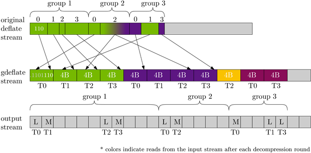

# GDeflate Reference Implementation

## Introduction

DEFLATE is a compression format that uses a combination of [LZ77](https://ieeexplore.ieee.org/document/1055714) compression and [Huffman](https://ieeexplore.ieee.org/document/4051119) coding. Literals and match copy lengths use a single Huffman tree and match copy distances use a separate Huffman tree. DEFLATE allows for three types of data blocks that make up the stream:
1. Dynamic Huffman compressed blocks of data where the Huffman trees are part of the compressed stream
2. Static Huffman compressed blocks where the Huffman trees are defined in [RFC 1951](https://datatracker.ietf.org/doc/html/rfc1951) and are not included in the compressed stream and
3. Stored blocks where the data is uncompressed.

Decompressing DEFLATE streams requires first decoding the Huffman encoded bitstream. Since the code lengths of each symbol in the stream are not known apriori, the stream must be decoded serially and it is therefore difficult to parallelize this decoding process. This is the issue that GDeflate addresses.
For a complete description of the DEFLATE compression format, refer to RFC 1951. The remainder of this document assumes familiarity with the concepts and terminology described in this RFC.

## GDeflate stream definition

GDeflate extracts parallelism from a DEFLATE stream by swizzling (or permuting) the bits in the bitstream in such a way that Huffman codes can be naturally read in parallel. The bit swizzling is done by first splitting the DEFLATE stream into 32 sub-streams and then serializing them to get the final GDeflate stream that allows for up to 32 way parallelism during decompression.

## GDeflate groups

The GDeflate stream is designed to allow for concurrent decoding of symbols from different sub-streams in a bulk-synchronous fashion. Literal or match copy (length+distance) bits of a standard DEFLATE stream are interleaved across the 32 sub-streams in groups. Each group is a set of <= 32 consecutive literal or length+distance codes. Codes of each group are assigned to sub-streams in the order in which they appear in the original DEFLATE stream and the following rules apply:
1. All bits required for a single literal or a match copy (length + distance) are always assigned to the same sub-stream.
2. The first group is comprised of 32 consecutive literal or length+distance codes.
3. If a sub-stream is assigned a length+distance code in group N, then it does not get assigned any bits in group N+1. Hence, group N+1 will have 32 less the number of length+distance codes in previous group N.

The schematic in the subsequent section shows an example of how DEFLATE symbols are assigned to groups.

## GDeflate decompression rounds

GDeflate decompression is performed in rounds where a single round is decoding a single Huffman symbol (either literal/length or distance) per sub-stream. If one thread is assigned per sub-stream, the interleaved bit assignment policy from the previous section ensures better load balancing across threads since match copies requiring two Huffman decodes take up two rounds while literals requiring only one Huffman decode take up only one round. This interleaved bit assignment policy to sub-streams also ensures that writes to the output stream can all be localized allowing for higher efficiency.

## GDeflate stream serialization

Serialization of sub-streams to get the final GDeflate stream is designed to ensure that reads from the stream are also localized and dense. The policy is implicitly defined by the decompression logic:
1. A 64 bit buffer per sub-stream holds the next 33 to 64 bits of that sub-stream (except at initialization when it holds the first 32 bits of the sub-stream).
2. In each round, one Huffman symbol (either literal/length or distance) is decoded per sub-stream and the bits used are consumed.
3. At the end of each round, sub-stream bit buffers that have <= 32 bits left read the next 32 bits from the corresponding sub-stream.
4. The serialization order of sub-streams guarantees that the 32 bit chunks read by each sub-stream at the end of each round appear consecutively in the serialized stream in the same order as the sub-streams (sub-stream j after sub-stream i for j > i).
5. The serialized stream is initialized with the first 32 bits of each sub-stream in order.

The figure below shows a schematic of how a DEFLATE block is swizzled to get the GDeflate block. To make the schematic more readable, this swizzling idea is shown with 4 way parallelism instead of 32. ‘L’ and ‘M’ in the output stream indicate literal and match copy respectively. Colors indicate 4 byte data reads at the end of each round. 

This swizzling idea is also extended to the representation of  Huffman code trees in dynamic Huffman blocks. The section below describes this in more detail.

## GDeflate swizzling order

### Initialization

At initialization, each sub-stream’s bit buffer loads 4 bytes of data from the stream and populates 32 bits of its 64 bits.

### Block header

Each block contains a 3 bit header. These bits are always assigned to sub-stream 0.

### Dynamic Huffman compressed blocks

### 14 bit header

Per RFC 1951, dynamic Huffman compressed blocks have an additional 14 bit header. These bits are always assigned to sub-stream 0. These bits define the integers HLIT, HDIST and HCLEN.

### Code lengths for the code length alphabet

Per RFC 1951, code lengths for the code length alphabet are 3 bits each, HCLEN+4 in number and are assigned to 32 sub-streams in a round-robin fashion starting with sub-stream 0. This assignment is in the DEFLATE defined order: 16, 17, 18, 0, 8, 7, 9, 6, 10, 5, 11, 4, 12, 3, 13, 2, 14, 1, 15.

### Code lengths

Per RFC1951, there are (HLIT + 257) + (HDIST + 1) code lengths that define the literal/length and distance Huffman trees. These are variable length Huffman encoded codes themselves and are assigned to 32 sub-streams in a round-robin fashion starting with sub-stream 0. Since some symbols are used to encode runs of code lengths (e.g. symbols 17 and 18 encode runs of zeros), there may be fewer codes than the total number of code lengths. 

### Literal, length and distance symbols

The bit assignment order for symbols is described in rounds. In each round, one symbol is decoded per sub-stream (either a literal/length symbol or a distance symbol).

In the first round, each sub-stream is assigned a literal/length code starting from sub-stream 0.

If a sub-stream gets a length code, the corresponding distance code is scheduled for the next round and assigned to the same sub-stream. This sub-stream will therefore not be assigned a new literal/length code in the next round.

All sub-streams that did not get a length code get assigned a new literal/length code in the next round.

Symbol 256 ends the literal/length codes.

There is a last round after encountering the end of block symbol (256) to process pending distance codes.

The table below shows symbols decoded by each sub-stream for the example in the schematic. Lt denotes a literal symbol, Ln denotes a length symbol and D denotes a distance symbol.

|Round|T0|T1|T2|T3|
|-----|--|--|--|--|
|0    |Lt|Ln|Lt|Ln|
|1    |Lt|D |Ln|D |
|2    |Ln|Lt|D |Lt|
|3    |D |  |  |  |
|     |  |  |  |  |

### Static Huffman compressed blocks

Static Huffman compressed blocks have pre-defined Huffman trees as described by DEFLATE. Sub-streams only need to have literal, length and distance symbols and the format is the same as in dynamic Huffman compressed blocks.

### Stored blocks

### Header

Stored blocks have a 4 byte header that is byte aligned and defines the number of bytes in the block. This header is always assigned to sub-stream 0 and is also byte aligned in sub-stream 0. All other sub-streams do not have specific alignment conditions.

### Data

Data in stored blocks are single bytes and these bytes are assigned to sub-streams in a round-robin fashion starting with sub-stream 0.

### Ending the stream

The GDeflate stream requires zero padding at the end of the stream to guarantee that data beyond the last valid bits don’t corrupt the Huffman decode process for each sub-stream. This is most easily done by padding the stream with 128 bytes (32 4B chunks) of zeros. This padding can be made more compact so long as the decompressor is guaranteed that reads occurring naturally until the round containing the last symbol using the GDeflate decompression logic are guaranteed to be within the stream.
