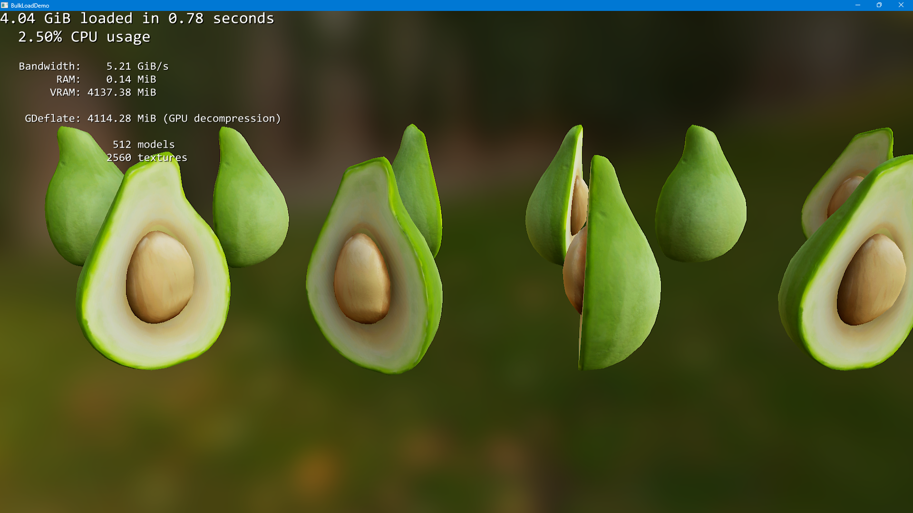
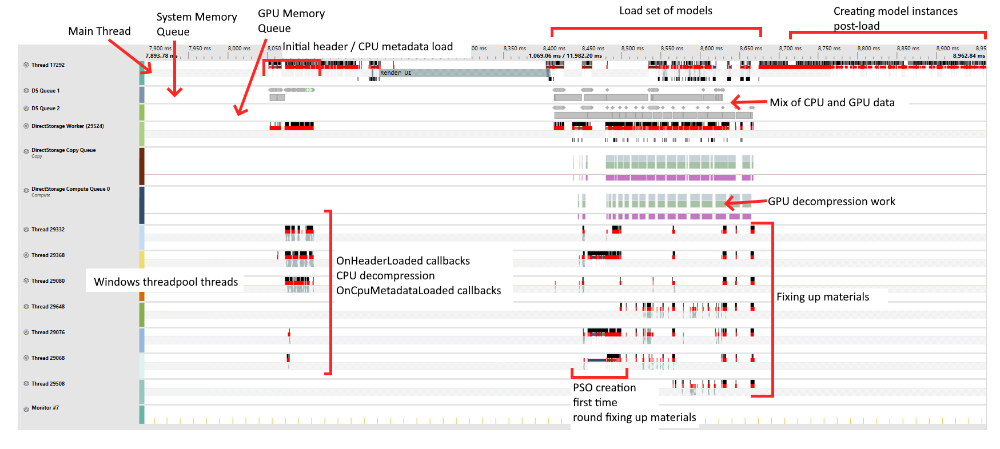

# Bulk Load Demo



This demonstrates using DirectStorage in a bulk-load scenario by loading multiple models measuring the time and CPU usage while loading.

This demo is based on [MiniEngine](https://github.com/microsoft/DirectX-Graphics-Samples/tree/master/MiniEngine) - making use of its glTF 2.0 support.

# Build

Install [Visual Studio](http://www.visualstudio.com/downloads) 2019 or higher.

Open the following Visual Studio solution and build
```
Samples\BulkLoadDemo\BulkLoadDemo.sln
```

# Usage

```
BulkLoadDemo [-dir <directory>] [-model <filename>] [-gpu-decompression {0|1}] [-debug {0|1}]
```

The demo can operate in one of three modes:

1. Default: by default, any `.marc` files in the same directory as the executable are loaded.  Multiple instances of these are loaded in order to ensure that there's enough work to do.

2. Single Model: The `-model` command-line argument can be used to specify a single `.marc` file to load.  This mode is mostly useful for debugging a single model.

3. Directory: The `-dir` command-line argument can specify a directory.  All `.marc` files within this directory are candidates for loading.

GPU decompression is enabled by default, but it can be explicitly enabled/disabled using the `-gpu-decompression` argument.

The D3D12 debug layer can be explicitly enabled or disabled using the `-debug` argument.  

Close the window, or press Escape, to exit the demo.

## Building `.marc` files

MiniEngine uses `.mini` files to serialize data from a .gltf file.  This demo uses `M`ini `Arc`hive files, that contain the serialized data as well as the textures required for a .gltf file.  `.marc` files can be generated using the MiniArchive tool.  

```
MiniArchive [-gdeflate|-zlib] [-stagingbuffersize=X] [-bc] source.gltf dest.marc
```

Assets can be compressed using GDeflate or Zlib.  Since individual DirectStorage requests cannot use more than the staging buffer size, MiniArchive needs to know when it must break a single request into multiple requests.  The `-stagingbuffersize` argument controls this.  The default is 256 MiB (which is what BulkLoadDemo sets the staging buffer size to).

Passing `-bc` will cause the textures to be converts to one of the BCn formats.

Also included is a powershell script, `convert.ps1`.  This is handy for converting all gltf files under a particular directory.  It assumes that the Release build of MiniArchive.ese has been built.  Usage:

```
./convert.ps1 <srcDir> <destDir> <additional arguments...>
```

The additional arguments are passed directly to MiniArchive.  The filenames are generated from the GLTF name, with additional disambiguation added if there are multiple GLTF files with the same name but in different directory.  Example usage:

```
./convert.ps1 c:\gltfs c:\marcs -gdeflate -bc
```

The will find all of the gltf files under `c:\gltfs` and convert them to `.marc` files under `c:\marcs`.  The files will be compressed using gdeflate and the textures will be BCn compressed.


## Obtaining sample GLTF files

Some sample assets can be found at https://github.com/KhronosGroup/glTF-Sample-Models/tree/master/2.0.  Note, however, that some of these samples use features that are not supported by BulkLoadDemo and can sometimes result in Device Removals.  There are many collections of free GLTF files available across the internet.


# How It Works

This demo can be seen as an exercise in converting an existing code base to one that makes good use of DirectStorage.

## Starting Point

MiniEngine already had support for reading glTF 2.0 files, and for loading/saving a binary serialized version of it.  Details of this file format can be found in [Model/ModelLoader.h]().  This provided a good starting point when designing the marc file format.

See [BulkLoadDemo/MarcFileFormat.h]() for the details of the file format.

Some considerations for the design:

1. Design to avoid dependent reads: DirectStorage works best when there are many outstanding IO operations.  For this reason, the file format is designed so that as much information as possible is already available.  For example, the `struct Header` contains everything needed to load the UnstructuredGpuData, CpuMetaData and CpuData.

1. Include textures in the same file as the rest of the model.  As a design point all of the assets for a single glTF file are stored inside a single file.  This makes the files easier to manage and avoids needing to access the file system to locate textures.  Texture names are only stored for debugging purposes and instead are reference by index. See `struct TextureMetadata` and `struct Material`.

2. Separate out data destined for system memory and memory destined for different types of GPU memory.  This allows us to use the appropriate DirectStorage request destination types for loading each bit of data.  See `struct Header` the various regions within it.

3. Arrange textures in the file according to GetCopyableFootprints, making them suitable for loading using a DSTORAGE_REQUEST_DESTINATION_MULTIPLE_SUBRESOURCES request.  Although this means including padding in the file, the padding compresses really well.  See `WriteTexture` in [MiniArchive/main.cpp]().

4. Separate out fixed size vs variable sized data; minimizing the amount of fixed size data.  Fixed sized data needs to be loaded uncompressed and needs to contain at least enough information to know how to load the compressed data.  This is why `struct Header` is separate from the other structs.

5. Centralize metadata about textures, arranged so that information required for memory / descriptor allocation can be stored without needing to load the entire model.  See `struct CpuMetadataHeader` for this, note that `TextureDescs` is arranged in a format suitable for passing directly to `ID3D12Device4::GetResourceAllocationInfo1`.

While some amount of thought upfront helped with the initial design, various changes were made as the loading code was written.  For example, separating TextureDescs from the rest of the TextureMetadata happened while writing the loading code.

## MiniArchive

MiniArchive's implementation is relatively straightforward.  It works by first asking MiniEngine's Model code to generate ModelData for a glTF asset.  It then collects this data, and the textures, to write out the final archive file.

## BulkLoadDemo

There are three main classes involved in this demo.  These classes divide the responsability like this:

* *BulkLoadDemo* - this has the main render/update loop in it, as well as the overall logic for the demo.  On startup, *BulkLoadDemo* determines which files are going to take part in the demo and adds them to *MarcFileManager*.  Then, every 10 seconds, it unloads the current set of files, picks the next set to load and loads them.

* *MarcFileManager* - this manages all the MarcFiles, keeping track of the overall state of loading a set of files - such as whether or not all the files are ready to load, or if the current set of files has been loaded.  This object also owns the single large ID3D12Heap that all the Model's resources are placed in.

* *MarcFile* - this is a single MarcFile.  This stores the metadata for the file along with the `Model` instance if the file is loaded.

### Adding Files

On startup, `BulkLoadDemo` tells `MarcFileManager` about files that might be loaded by calling `MarcFileManager::Add`.  This creates a new `MarcFile` instances and calls `MarcFile::StartMetadataLoad` on it, which then issues a single request to load the header.  A Win32 event is used to detect when this load has completed, and a [Threadpool Wait](https://learn.microsoft.com/en-us/windows/win32/api/threadpoolapiset/nf-threadpoolapiset-setthreadpoolwait) is used to configure a callback when this has happened.

> Note: there's potential for improving this - as it is now, `MarcFile` is pretty standalone.  However, if we know that it'll _always_ be loaded in a set of other MarcFiles then we could have a single event to indicate that _all_ metadata has been loaded, instead of having one per-file.

Once the header has completed loading it can be validated and then the CPU metadata region can be loaded.  This region is variable size, and compressed, so we need the data in the header in order to load it.

When the CPU metadata has finished loading it is fixed up (offsets are converted to pointers) and some device-specific calculations are performed (eg getting the resource allocation information for the textures and creating a CPU-visible descriptor heap upfront.)

### Loading a new set

MarcFileManager provides an ID for each file that is added to it; BulkLoadDemo stores a vector of these IDs.  When it is time to load a new set, this vector is shuffled and passed to `MarcFileManager::SetNextSet`.

`SetNextSet` then calls `TryStartLoad` for each file.  This will determine if there's enough room in the heap for all the model's GPU data.  Regions in the heap and the descriptor heap are then allocated, and `MarcFile::StartContentLoad` begins the content loading process.

### Content Load

Content load can immediately issue all the requests required to load the CPU data, unstructured GPU data and textures.  The essentially becomes two batches (one for the system memory queue and another for the GPU queue).

Once both the CPU and GPU data has finished loading a final round of fixups can be applied.

### Unloading

Before unloading a model we need to be sure that the model's resources are no longer in use by the GPU.  Once we can be certain that the GPU isn't / won't be referencing these resources we can release them.

### Custom Decompression

DirectStorage does not natively support ZLib.  Instead, this demo uses the custom decompression feature to integrate ZLib decompression.  See [BulkLoadDemo/DStorageLoader.cpp]() for details on how custom decompression is implemented in this demo.

## Timeline

Below is an annotated screenshot of a PIX timing capture taken of BulkLoadDemo starting up, loading a number of GDeflate compressed assets.
 


