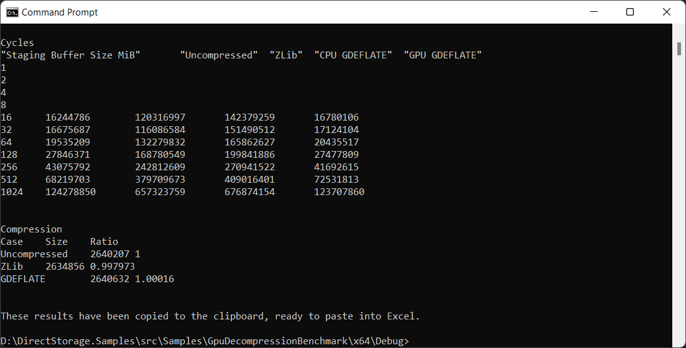
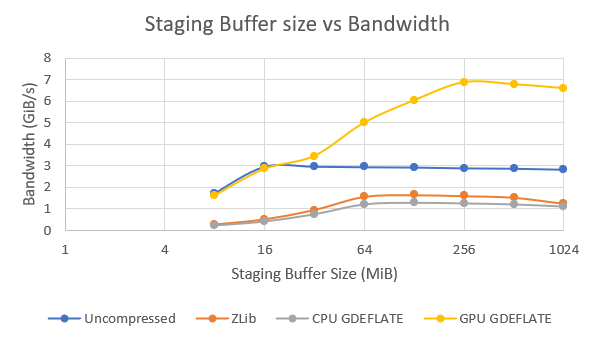
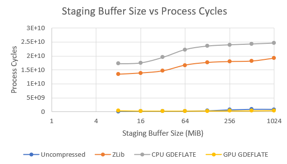

# GpuDecompressionBenchmark
This sample provides a quick way to see the DirectStorage runtime decompression performance by reading the contents of a file, compressing it and then decompressing multiple ways while measuring the bandwidth and CPU usage.  Decompression is performed using the GPU as well as the CPU for comparison.



The benchmark results will be copied to the clipboard, and ready to paste into this [Excel document](Visualization.xlsx) which will render graphs like the following.






# Build
Install [Visual Studio](http://www.visualstudio.com/downloads) or higher.

Open the following Visual Studio solution and build
```
Samples\GpuDecompressionBenchmark\GpuDecompressionBenchmark.sln
```

# Usage
Example usage
```
Samples\GpuDecompressionBenchmark\x64\Debug\GpuDecompressionBenchmark.exe SomeDataFile.ext
```

## Related links
* https://aka.ms/directstorage
* [DirectX Landing Page](https://devblogs.microsoft.com/directx/landing-page/)
* [Discord server](http://discord.gg/directx)
* [PIX on Windows](https://devblogs.microsoft.com/pix/documentation/)

