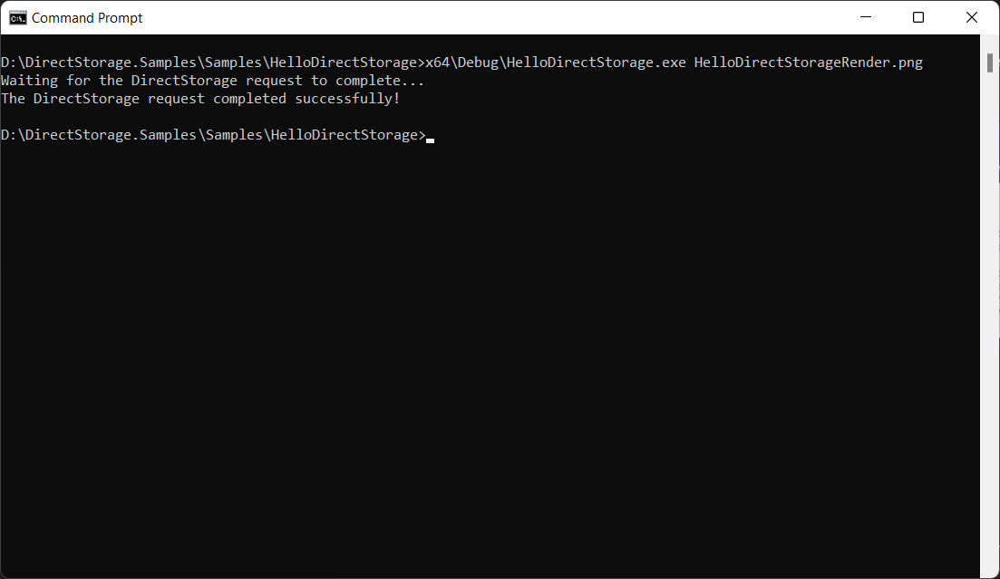

# HelloDirectStorage
This rudimentary sample serves to provide a quick and easy way to get acquainted with the DirectStorage runtime by reading the contents of a file and writing them out to a buffer on the GPU using DirectStorage.




# Build
Install [Visual Studio](http://www.visualstudio.com/downloads) or higher.

Open the following Visual Studio solution and build
```
Samples\HelloDirectStorage\HelloDirectStorage.sln
```

# Usage
Example usage
```
Samples\HelloDirectStorage\x64\Debug\HelloDirectStorage.exe HelloDirectStorageRender.png
```

## Related links
* https://aka.ms/directstorage
* [DirectX Landing Page](https://devblogs.microsoft.com/directx/landing-page/)
* [Discord server](http://discord.gg/directx)
* [PIX on Windows](https://devblogs.microsoft.com/pix/documentation/)

