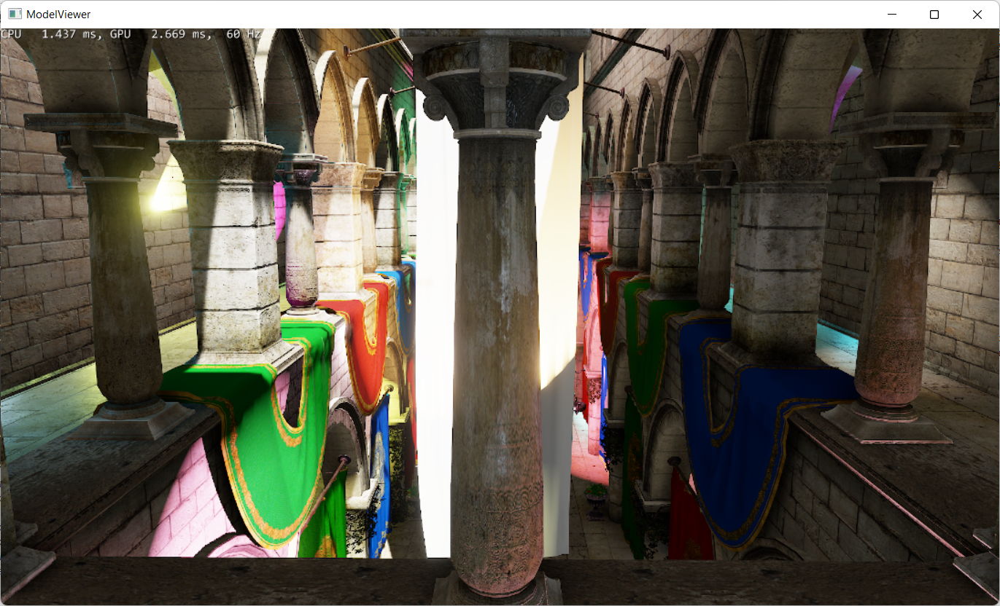
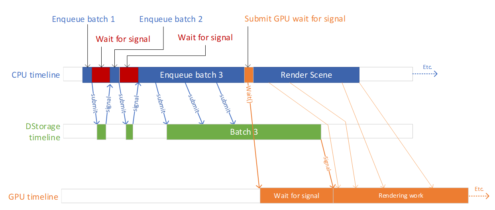
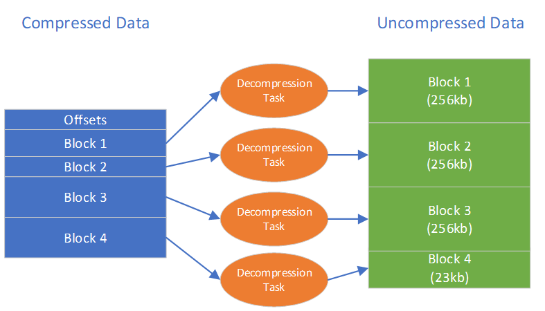

# MiniEngine (ModelViewer)
This version of the miniengine ModelViewer sample (original sample [here](https://github.com/microsoft/DirectX-Graphics-Samples/tree/master/MiniEngine)) has been updated to use DirectStorage for Windows to load its assets and demonstrates how to decompress assets with your existing CPU decompression codecs.




# Build
Install [Visual Studio](http://www.visualstudio.com/downloads) 2019 or higher.

Open the following Visual Studio solution and build
```
Samples\MiniEngine\ModelViewer\ModelViewer.sln
```

# Usage

Use the -model commandline switch to specify a different data file.

Example
```
modelviewer -model sponza/sponza.uncompressed.h3da
```

The following table shows the different supported model files.  Note that the sample will choose to use DirectStorage only for the .h3da (archive based) data files.

| Model File | Uses DirectStorage | Archive Format | Compression |
| -----------|--------------------|----------------|------------ |
| sponza.zlib.h3da| Yes | Yes | Zlib|
| sponza.uncompressed.h3da| Yes | Yes | None|
| sponza.h3d (original) | No | No | None|

The archive data files were constructed using the H3DArchive commandline tool which is also include in the ModelViewer solution.  The following commandlines were used to produce them.

```
h3darchive sponza/sponza.h3d sponza/sponza.uncompressed.h3da
h3darchive -zlib sponza/sponza.h3d sponza/sponza.zlib.h3da
```

### Archive File Format
The original sample loaded sponza.h3d.  This file contained the geometry and material data, including references to all the texture files that needed to be loaded.  The texture files themselves were DDS files.  Unfortunately, a DDS file by itself is not suitable for loading with DirectStorage. This is because:

* DDS files contain metadata that’s required for interpreting the rest of the file which does not lend itself to asynchronous loading.  For example, the header section needs to be read to the CPU before the remaining data can be read to the GPU.
* The texture data itself is not laid out in a format suitable for passing to CopyTextureRegion.  For example, the DDS file does not align the pitch to D3D12_TEXTURE_DATA_PITCH_ALIGNMENT.

For these reasons all the data is stored in an archive format “h3da” that has been designed for efficient use with DirectStorage. This format is intended to demonstrate the things that need to be considered when designing file formats suitable for loading with DirectStorage.  It is not intended to be a general purpose, production ready, format.

Key design points for the file format were:

* As much of the file as possible is compressed.
* The file can be loaded without having to stop and inspect the results of requests, as much as possible.
* DirectStorage is able to shepherd data to its final location without the application needing to manage its own staging buffers.

| Section/struct | Destination | Notes |
| ---------------|-------------|-------|
| H3DArchiveHeader | System Memory | Contains enough data to figure out the next set of requests. This is the only section that is uncompressed.
| ModelH3D::Mesh[] ModelH3D::Material[] H3DArchivedTexture[] | System Memory | These structures can all be read by a single request. |
Geometry Data (byte array) | GPU Buffer | The vertex and index buffers, this is read into a single buffer on the GPU.  The header describes the offsets for the index/vertex buffers within this single buffer. |
| Textures | GPU Textures | The H3DArchivedTexture describes where to find and how to load each texture.  Each texture (including all subresources) can be loaded using a single request. |

Please see the H3DArchive project for more details on how this file is generated.
DirectStorage currently has a limit that a single request can be no larger than the staging buffer after decompression.  The staging buffer defaults to 32MB.  For this data set this isn’t an issue, so we can use a single request to load all the textures.  Titles may need to do work to split up resources that exceed the staging buffer size.

## Loading in the engine
Most of the implementation of the DirectStorage loader can be found in the DStorageLoader.cpp file in the Model directory.  The public entry points are for initialization, shutdown and loading a model.

### InitializeDStorage
The creates the two queues that are used by this sample – one queue used for reading data into system memory, and another used for reading data to the GPU.
It also configures the custom decompression system by obtaining a handle to the Windows Event object that will be set whenever new items require custom decompression.  In this example we use the Windows thread pool to register a function to be called when the handle is set.  See below for more details on the custom decompression implementation.

### ShutdownDStorage
This releases the various objects the sample uses to ensure a controlled run down.

### DStorageLoadH3DAInto
This is where the loading happens.  To try and keep the existing model viewer code as untouched as possible, this function is given a pre-constructed (but not loaded) Model object and then proceeds to populate it with data read from the h3da file.
An overview of the loading process follows.  This refers to “batches”.  DirectStorage doesn’t have any object or method called “batch”.  A batch in this case means “work between a signal/status”.  It is convenient to think in terms of batches.  Request within a batch can execute in any order, so the more requests there are in a batch, the more opportunity give to DirectStorage and the IO stack to optimize the scheduling of the work. 

* Batch 1:
  * Enqueue request to load header to system memory
  * Enqueue fence signal
  * Submit
* Block until the fence has been signaled.
* Batch 2:
  * Enqueue request to load all CPU data to system memory
  * Enqueue fence signal
  * Submit
* Block until the fence has been signaled.
* Peform some fixup/validation on the CPU data that was loaded
* Batch 3:
  * Create ID3D12Resource for the geometry data
  * Enqueue request to load geometry data to that resource
  * For each texture
    * Create an ID3D12Resource for the texture
    * Enqueue request to load the texture
  * Enqueue fence signal
  * Submit
* Create IBV/VBV for geometry data
* Create SRVs for materials, referring to the texture resources created earlier (but that are still loading asynchronously)
* Issue Waits on all the application's command queues to ensure that they don't try and use any of the resources before they have finished loading.

Note here that for most of the data being read - the geometry and textures - the various requests are processed asynchronously.  The application only needs to check when these are entirely completed.

This diagram shows how this conceptually fits together with the corresponding CPU, DirectStorage and GPU timelines.



The GPU timeline here illustrates that the signal from DirectStorage, enqueued at the end of batch 3, unblocks the GPU to start rendering.  However, the CPU can still build up command lists and execute them without waiting for the batch 3 to complete.

There are periods where the CPU and DirectStorage are blocked waiting for synchronous IO (ie between the batches).  This is something that should generally be avoided if possible. In the context of this sample, if it were to load multiple models (rather than just one) then there’s a potential to have the synchronous work for each model enqueued at once. 

Note that Submit can be called for “batch 3” even before it has been completely built up.  The end of the “batch” is the enqueued signal.  This allows DirectStorage to start processing the batch earlier.

# Custom Decompression
## Architecture
The sample also supports zlib decompression, using DirectStorage’s custom decompression queue.  Zlib decompression isn’t particularly fast, so this sample uses multiple threads to decompress data in parallel.

If each region were simply compressed as a single stream of zlib data, then large requests could become a bottleneck since only one thread could operate on a request at a time. To mitigate this, the data within a single request is split up into multiple independently compressed “blocks”, each one decompressing to no more than 256k.  This allows multiple threads to work on decompressing a single request in parallel.  The format for each request’s data is therefore an array of offsets to the start of each block, followed by the blocks themselves.  The decompressor knows how many blocks there are as this is determined by the uncompressed size of the data.



In the above diagram the uncompressed data’s total size is 791kb.  This is split up into 4 blocks – 3 blocks of 256kb, and a final block of 23kb.

This sample uses the Windows threadpool to schedule these tasks.  Here’s what the code does:

## Configuration
Search for "Configure custom decompression queue" in DStorageLoader.cpp to see the code that does this.

* Retrieve an IDStorageCustomDecompressionQueue pointer via QueryInterface (ie ComPtr::As)  from the IDStorageFactory.
* Retrieve the event HANDLE from the IDStorageCustomDecompressionQueue via GetEvent().
* Configure a threadpool wait so that OnCustomDecompressionRequest() is called when this event is set.
DirectStorage will set this event whenever there are custom decompression requests that need to be processed.

## Processing Custom Decompression Requests
Search for "Custom decompression implementation" in DStorageLoader.cpp to see the code associated with this.

OnCustomDecompressionRequest() is responsible for retrieving requests that need to be processed and then enqueuing work on the threadpool to perform the decompression.

* IDStorageCustomDecompressionQueue::GetRequests() can be used to populate an array with requests that need to be processed.  Multiple requests can be retrieved with one API call in order to reduce the overhead of calling into the API.  In this sample up to 64 requests are retrieved at a time.
* ScheduleDecompress is called on each request this:
Allocates a “DecompressionRequest” object that tracks the state associated with the request.
Figures out the block count (by looking at the destination size for decompression)
Schedules a work item on the threadpool for each block.
* Just before returning, OnCustomDecompressionRequests() sets the threadpool wait again so that it will execute the next time the event gets set.

OnDecompress() performs the decompression for a single block.  Each OnDecompress() is passed a pointer to  DecompressRequest object that contains the DSTORAGE_CUSTOM_DECOMPRESSION_REQUEST data and three atomic integers.  The first of these, NextBlock, is used to figure out which block this particular OnDecompress() should operate on.  From that information it is possible to find the offset to the block’s compressed data (by looking it up in the offsets array) and where the decompressed data should be written to.

Of note here, the destination buffer provided by DirectStorage is likely to be in an upload heap. This means that it is write combined memory, which should only be written to sequentially, and not read from.  It turns out that zlib’s uncompress function reads from the buffer it is writing to. For this reason, we decompress to a temporary buffer that we then memcpy to the destination buffer. If there is an error then this is recorded in the ErrorCode atomic.

Finally, the NumBlocksCompleted atomic can be used to determine if this particular OnDecompress() call is the final one to complete.  If it is then DStorageCustomDecompressionQueue::SetRequestResults() is used to inform DirectStorage that this request has been completed, and the DecompressRequest object is deallocated.

The net result of all of this is that the sample has pretty good utilization of the CPU while decompressing, and can start working on initializing other parts of the renderer even as the DirectStorage is loading the GPU assets.  

## Related links
* https://aka.ms/directstorage
* [DirectX Landing Page](https://devblogs.microsoft.com/directx/landing-page/)
* [Discord server](http://discord.gg/directx)
* [PIX on Windows](https://devblogs.microsoft.com/pix/documentation/)

